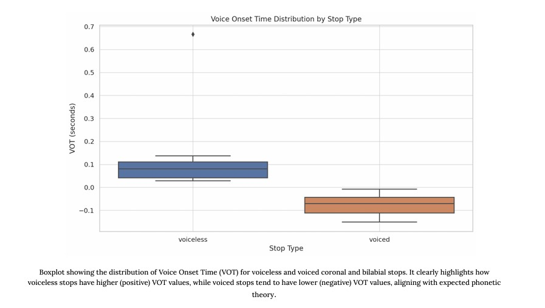

# 📢 VOT Analysis of Marathi

A phonetic study analyzing **Voice Onset Time (VOT)** in Marathi **coronal** and **bilabial stops**, using `.wav` recordings from native speakers, annotated TextGrids via **Praat**, and speaker-wise comparisons across **aspiration** and **voicing** categories.

---

## 📚 Overview

**Voice Onset Time (VOT)** is the interval between the release of a stop consonant and the onset of vocal fold vibration. This study focuses on:

- Measuring VOT in **voiced** and **voiceless** **aspirated/unaspirated** stops in Marathi
- Comparing differences across **coronal** (/t/, /d/, /ʈ/, /ɖ/) and **bilabial** (/p/, /b/) places of articulation
- Studying speaker-specific variation (e.g. gender-based patterns) in VOT realization

---

## 🎯 Objectives

- To quantify VOT values of initial-position plosives in Marathi
- To analyze how **aspiration**, **voicing**, and **place of articulation** affect VOT
- To contribute empirical data for Marathi phonetics using acoustic analysis

---

## 🧪 Methodology

### 🗂 Dataset Creation

- A curated word list of **36 Marathi words** targeting 12 plosive phonemes
- 6 native Marathi speakers (3M, 3F), ages 21–52
- Recordings done in silent settings using mobile microphones
- `.wav` files manually annotated using **Praat**, marking plosive burst and voicing onset

### 🛠 Tools Used

- **Praat** for annotation and acoustic analysis
- **Python/Excel** for plotting, statistics, and visualization

---

## 🔤 Phoneme Classes Studied

| Type | Voiceless | Voiced |
|------|-----------|--------|
| **Bilabial** | /p/, /pʰ/ | /b/, /bʱ/ |
| **Coronal (Dental)** | /t̪/, /t̪ʰ/ | /d̪/, /d̪ʱ/ |
| **Coronal (Retroflex)** | /ʈ/, /ʈʰ/ | /ɖ/, /ɖʱ/ |

---

## 📊 Key Findings

- Voiceless **aspirated** stops showed consistently **higher VOTs** than unaspirated ones
- **Voiced stops** demonstrated **negative VOTs**, aligning with expected phonetic behavior
- Some **gender-based variation**: female speakers showed slightly shorter VOTs in aspirated stops
- Inter-speaker variability suggests interesting individual phonetic tendencies

---

## 📁 Repository Structure

```
VOT-Analysis-of-Marathi/
├── 📂 Final Sound & Textfiles/           #  Final audio & Praat TextGrid files used in analysis
    ├── 📂 Recordings  # Processed mono-audio files
    ├── 📂 TextGrids          # Processed TextGrid annotations
├── 📂 Audio files/           # 
    ├── 📂 orginal recordings  # Raw recordings from participants
    ├── 📂 wav files          # Converted .wav versions of original files (unprocessed)
├── 📂 Visualizations/
│   └── distribution across stop types.jpg     # Boxplot comparing voiced vs. voiceless stops
├── 📄 A Study on the VOT... # Complete project report (PDF)
├── 📄 Male vot.xlsx        # Calculated VOT values for male speakers
├── 📄 Marathi Word List.pdf # Word list used for data collection
└── 📄 README.md            # This file
```

---

## 🚀 Getting Started

### Prerequisites

- **Praat** (for viewing TextGrid annotations)
- **Python 3.7+** with libraries: `pandas`, `numpy`, `matplotlib`, `seaborn`
- Audio player capable of `.wav` files

### Usage

1. Clone the repository:
   ```bash
   git clone https://github.com/AlphaPruned/VOT-Analysis-of-Marathi.git
   cd VOT-Analysis-of-Marathi
   ```

2. Explore the data:
   - Open processed audio files from `/Final Sound & Textfiles/Recordings/`
   - Open corresponding TextGrids from `/Final Sound & Textfiles/TextGrids/`
   - View raw recordings under `/Audio files/`
   - Open the boxplot visualization from `/Visualizations/distribution across stop types.jpg`

---

## 📈 Data Analysis

The study includes comprehensive statistical analysis of VOT measurements across:

- **Voicing contrast** (voiced vs. voiceless)
- **Aspiration contrast** (aspirated vs. unaspirated)
- **Place of articulation** (bilabial vs. coronal)
- **Speaker demographics** (gender and age effects)

---

## 🔍 Sample Results

### 📷 Boxplot: Distribution Across Stop Types  
*(Located at `/Visualizations/distribution_stoptypes.png`)*  
This plot shows the VOT distribution of **voiced vs. voiceless** stops across all speakers.



---

## 🧠 References

- Praat documentation: [https://www.fon.hum.uva.nl/praat/](https://www.fon.hum.uva.nl/praat/)
- Marathi Phonology – Wikipedia
- "Voicing and Aspiration in Marathi Stops" – Ari Natarina
- "Capturing Breathy Voice in Marathi" – Kelly Harper Berkson

---

## 👥 Authors

- **Arnav Kadu** – 112101022  
  📧 arnavkaducr7@gmail.com  
- **Pranav Rao** – 112101038  
  📧 pranavrao2500@gmail.com 

---

## 🤝 Contributing

We welcome contributions and suggestions! Please:

1. Fork the repository
2. Create a feature branch (`git checkout -b feature/improvement`)
3. Commit your changes (`git commit -am 'Add some improvement'`)
4. Push to the branch (`git push origin feature/improvement`)
5. Open a Pull Request

---

## 📬 Contact

For questions or collaboration opportunities, please open an issue or contact the authors through GitHub.

---

## 🙏 Acknowledgments

Special thanks to Prof. Reenu Punnoose and  Ms.Caterine Ann Michael for their guidance and feedback throughout the project.

We’re also deeply grateful to all the native Marathi speakers who participated in the recording sessions and helped make this phonetic study possible.

